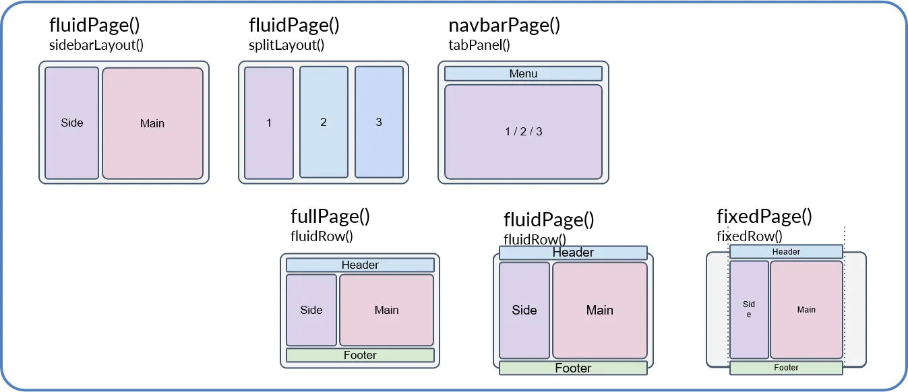
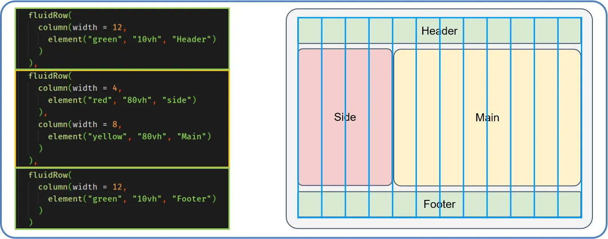

```{r setup, include=FALSE}
knitr::opts_chunk$set(echo = TRUE)

ipak <- function(pkg){
  new.pkg <- pkg[!(pkg %in% installed.packages()[, "Package"])]
  if (length(new.pkg))
    install.packages(new.pkg, dependencies = TRUE,
                     repos='http://cran.us.r-project.org')
  sapply(pkg, require, character.only = TRUE)
}

ipak(c('shiny','shinythemes','shinydashboard','beepr'))


```

Welcome to a very basic help/info guide for R Shiny!\
\
R shiny is a package for program R that allows you to build applications with an HTML front end, and an R backend. This means that the portion of the app a user sees is built using bits of HTML code pre-packaged into R functions which you use to build user interfaces (UI). The back end of a Shiny app, or server, operates using R code. It is a super useful tool that allows you to bring complex data processing or other complex operations to users without them needing to understand what's happening. 

I started learning about Shiny with the intention of building a front end interface that allows technicians to enter data to  Borderlands Research Institute's (BRI) data warehouse, an Amazon Web Service (AWS) web hosted PostgreSQL relational database, without learning how to code in R or the need to interact with the BRI warehouse.\

These ambitions led me to build two applications. A bear project management app where members of the bear team, students and technicians, can view and upload data, manage some basic inventory (collars, inReach devices, cameras), and even view properties and collar data on an interactive map.\
The other is an application intended to ease the workload for camera trap projects. It integrates Microsoft's open source megadetector image recognition model to identify whether or not there is an animal in a photo, and a user interface for technicians to identify detections to specific species. After processing, the data is submitted to the BRI data warehouse with photos being stored in the BRI AWS S3 bucket, another web hosted data storage system that works for large data types.\


#    Shiny Structure

Shiny apps will all have these same 3 parts, the **Global**, **UI**, and **Server**. Some apps may have a lot more going on around these, but all apps will have these three basic parts. 

### Global

This part of the app is intended for you to 'get things set up'. This is where you load necessary packages, load data needed for app operation, connect to databases, source other files/scripts, set up reactive objects, and load any other pieces of information your app needs to operate. This section is usually not very large for simple apps, but can be extensive in larger ones. 

### UI (User Interface)

This is the portion of the app the user actually sees and interacts with. It can be as specific or as general, as needed. For apps with little function or simple layouts, all layout elements can be specified in the **UI**. But if you are planning on having a very dynamic layout, only the bare bones of the layout would be specified in the **UI**, and all other dynamic parts will be built in the **Server** file. Under the hood the **UI** is built using HTML, the coding language used to build websites. If you are curious, right click on any webpage and hit the 'inspect' button in the menu and it will show you all the underlying HTML. It's really gross!! Shiny is cool because it allows you to wrangle the flexibility and power of HTML, without needing to know how to code in HTML. Shiny provides you with a surprisingly comprehensive set of functions that build HTML layouts as a result so you don't have to.

There are many pre designed layouts available to start from. There are a few that come with the Shiny package (see below), but there are some other packages that provide more layouts, of which, my favorite is Shiny dashboard. Think of it as base R graphics and ggplot2, the base R graphics work, but ggplot tends to be a lot prettier and more flexible. Shiny dashboard has some great resources for building intuitive and aesthetically pleasing **UI**'s (https://rstudio.github.io/shinydashboard/). 

There is a structured way that **UI**'s are built. We will use the `sidebarLayout()` layout for an example further down in this document. Here are some examples of Shiny's default layouts:\
```{r, echo=FALSE, out.width=700, out.height= 300, fig.cap="A nice image."}

```
\
Fig 1
\

Within the sections of these layouts (or a blank page, if you choose to go that route) there is a structure for placing elements on the page. Elements can include inputs elements, titles, boxes, or output spots in which to display things like photos, tables, or figures. The method for 'mapping' where items are placed follow this structure:\
```{r, echo=FALSE, out.width=700, out.height= 300, fig.cap="A nice image."}

```
\
Fig 2
\

This graphic is a custom made layout, not one of the preset layouts through Shiny as seen in Fig 1. The three sections in the R code on the left side (the three `fluidRow()`'s) correspond to the three rows on the example layout on the right (the Header, Side/Main, and Footer). The first `fluidRow()` that creates the Header section contains a `column()` function. Just as the names would suggest, `fluidRow()` creates rows, and `column()` creates columns. Because `column()` is nested within `fluidRow()` in this instance, it will create a single column of width 12 within the Header section. In this particular case, it is within `column()` that you would place elements to have them be displayed within the Header section. However, `column()` is not the only place you can put elements, you can place elements anywhere within this layout. But placing them within `column()` allows you to better control the structure. 

You can see that the center portion of the code has two `column()`'s within the `fluidRow()`. These correspond to the Side and Main portions of the layout on the right. The first `column()` is of width 4, and the second `column()` is of width 8, which add up to the total width of 12 to fill the width of the page. It isn't shown explicitly in this figure, but the width of each section is 12. So even though the Side section is only of with 4 when looking at the entire page, when we start placing elements within the section, we have a width of 12 to work with again. 

The height of the different sections is dictated by what elements you place within each `column()`. If you ran this example code here, all three `fluidRow()`'s would be the same height. The height of Main/Side are exaggerated for effect. 


Here are some examples of input elements you can put into a **UI**:
```{r, eval=FALSE}
    ## Global -------------------------------------------------- Create a reactive value to use in the server 
    ## UI ------------------------------------------------------ Create User Interface layout
ui <- fluidPage(

    # Application title
    titlePanel("Input elements"),
    br(),br(),

    # Sidebar with a slider input for number of bins 
    fluidRow(
      column(3, 
             actionButton('button','Action Button'),
             radioButtons('radiobuttons','Radio Buttons',choices = c('a','b','c'))),
      column(3, 
             selectInput('selectinput','Select Input',choices = c('a','b','c')),
             checkboxInput('checkbox','Check Box Input')),
      column(3, 
             checkboxGroupInput('cbgi','Check Box Group Input',choices = c('a','b','c')),
             sliderInput('slider','Slider Input',0,10,5)),
      column(3, 
             textInput('text','Text Input',value = ''),
             numericInput('numeric','Numeric Input',value = ''))
    ),br(),br(),hr(),
    box(title = 'Results',
    fluidRow(
      column(3,
             textOutput('button_output'),
             textOutput('radio_output')
             ),
      column(3,
             textOutput('select_output'),
             textOutput('checkbox_output')
             ),
      column(3,
             textOutput('cbgi_output'),
             textOutput('slider_output')
             ),
      column(3,
             textOutput('text_output'),
             textOutput('numeric_output')
             )
    )
    , width = 12)# end box
    
    )

    ## Server -------------------------------------------------- Define Server logic
server <- function(input, output) {
  output$button_output <-    renderText(paste0('Button output: ',as.character(input$button)))
  output$radio_output <-     renderText(paste0('Radio button output: ',input$radiobuttons))
  output$select_output <-    renderText(paste0('Select output: ',input$selectinput))
  output$checkbox_output <-  renderText(paste0('Checkbox output: ',input$checkbox))
  output$cbgi_output <-      renderText(paste0('CH Bx group output: ',paste0(input$cbgi, collapse = ' ')))
  output$slider_output <-    renderText(paste0('Slider output: ',input$slider))
  output$text_output <-      renderText(paste0('Text output: ',input$text))
  output$numeric_output <-   renderText(paste0('NUmeric output: ',input$numeric))
}

    ## --------------------------------------------------------- Run the application 
shinyApp(ui = ui, server = server)
```


### Server

This is where the magic happens! The **Server** file is where all processes and operations live that dictate the behavior of your app. The app will continuously be observing the **server** file and will run its different portions given different user inputs. 

There are two parts, essentially list objects, that live underneath the operations of the **server**; the input and output objects. The input object is where all input element values live. Examples of input elements are `textInput()`, `selectInput()`, `actionButton()`, `numericInput()`, and `dateInput()` as we saw above. These are very handy input functions that create elements users can interact with to input data.\

When you create an element in the **UI** (or wherever you create the element) you assign it an inputid. This id, or tag, will be how you access the value of, or make functions observe, different input elements in the **Server**. The **Server** file can end up being VERY long depending on how complicated your app is, but only certain parts of it are run at one time. This

A major part of how Shiny operates is by *observing* different portions of the **Server** file. There are a few functions that dictate how this works, but some of the common ones are `observe()` and `observeEvent()`. The `observe()` function tells R to continuously run the code within it. I don't entirely understand how R knows when or how often to run all the `observe()` functions within the **Server** file, but somehow it gets it right. The code within `observeEvent()` functions will only be run when input elements, reactive values, or other elements that change are changed. `observeEvent()`'s can be programmed to  observe one or more elements. Once triggered, the code within them is run. This all means that there is no required structure for the server file. You can put `observeEvent()`'s that do different things anywhere in the file and it would run just fine. R is observing the entire file at one time, and just runs the ones that meet a certain condition. However, it helps with readability and trouble shooting to put `observeEvent()`'s that do similar things or are associated with one particular app function in the same place.\


\newpage
#    Shiny Function

The App will run these pieces in a particular order. It will start with the **Global** portion, then the **UI**, and lastly the **Server**. The **Global** and **UI** will only be run once, when the app starts up, but the server will constantly be observed and portions will be re-run given inputs from the user. 


Lets look at a some examples:\
```{r, eval=FALSE}
    ## Global --------------------------------------------------  
    ## UI ------------------------------------------------------ Create User Interface layout
ui <- fluidPage(

    # Application title
    titlePanel("Single observeEvent with one trigger"),
    br(),br(),

    # Sidebar with a slider input for number of bins 
    fluidRow(
      column(2, actionButton('button','Button')),
      column(6, h2(textOutput('text_output_slot')))
    )
    
    )

    ## Server -------------------------------------------------- Define Server logic
server <- function(input, output) {

  observeEvent(input$button,{
    
     output$text_output_slot <- renderText(as.character(input$button))
    
  })
  
}
    ## --------------------------------------------------------- Run the application 
shinyApp(ui = ui, server = server)
```


This app uses one input, an action button with element id 'button', to trigger the single `observeEvent()` in the **Server** function. The underlying function behind an action button is a simple counter. The element value in the input object is simply a number. When the app is opened, the value for all action buttons is 0, and when you press them, they go up 1 in value. So you can just put the value of the action button in the output slot with the element id 'text_output_slot' to display it in the **UI**.\

You can make the `observeEvent()` observe 2 inputs like this:
```{r, eval=FALSE}
    ## Global -------------------------------------------------- Create a reactive value to use in the server 
    ## UI ------------------------------------------------------ Create User Interface layout
ui <- fluidPage(

    # Application title
    titlePanel("Single observeEvent with 2 triggers"),
    br(),br(),

    # Sidebar with a slider input for number of bins 
    fluidRow(
      column(2, actionButton('button','Button'),
                actionButton('button2','Button2')),
      column(6, h2(textOutput('text_output_slot')))
    )
    
    )

    ## Server -------------------------------------------------- Define Server logic
server <- function(input, output) {

  observeEvent({
    input$button
    input$button2
    },{
    
     output$text_output_slot <- renderText(as.character(input$button+input$button2))
    
  })
}

    ## --------------------------------------------------------- Run the application 
shinyApp(ui = ui, server = server)
```


We can also make a sort of reaction chain that when one `observeEvent()` is triggered, something changes inside that triggers another `observeEvent()`. 
There is another cool Shiny data object I'm going to use here also, called a reactive value. The functions used to make these type of objects are `reactiveVal()` and `reactiveValues()`. I believe  `reactiveVal()` can take the form of any R data type, but just a single one. The function `reactiveValues()` on the other hand can take multiple data objects and outputs something that acts like a list object. These Shiny specific reactive objects differ from regular R objects in that they are able to be accessed and updated anywhere is the app. Just like in any R function, a variable assigned within an `observeEvent()` function will not be accessible outside the function. To be able to access data between `observeEvent()`'s, we need to use a reactive value. I use `reactiveVal()` in this example to make a reactive value called index that I update in the first `observeEvent()`, and use as an index in the second `observeEvent()`. As you can see, I actually used the **Global** section of this app too. You can create reactive values in the **UI** or in the **Server**. 

Like this:
```{r, eval=FALSE}
    ## Global -------------------------------------------------- Create a reactive value to use in the server 
    index <- reactiveVal()
    ## UI ------------------------------------------------------ Create User Interface layout
ui <- fluidPage(

    # Application title
    titlePanel("Simple observeEvent example"),
    # adding blank rows to space some things out
    br(),br(),

    # Creating 2 action buttons and an output slot in which to put some text
    fluidRow(                                         # start a fluid row
      column(2,                                       # add a column of width 2
             actionButton('button','Button'),         # add an action button with element id 'button'
             actionButton('button2','Button2')),      # add a second action button with element id 'button2'
      column(6,                                       # add a second column in this fluid row
             h2(textOutput('text_output_slot'),       # add an output slot to display some text with element id 'text_output_slot'
                   ))
    )
    
    )

    ## Server -------------------------------------------------- Define Server logic
server <- function(input, output) {

  # first observeEvent that observes 'button' and 'button2'
  observeEvent({
    input$button
    input$button2
    },{
    # placing text in the output slot 'text_output_slot'
    output$text_output_slot <- renderText(as.character(input$button+input$button2))
    # updating the value of index()
    index({input$button+input$button2})
  })
  
  # the second observeEvent that observes index()
  observeEvent(index(),{
    
    # playing a sound
    beep(index())
    
  })
   
}
    ## --------------------------------------------------------- Run the application 
shinyApp(ui = ui, server = server)
```


Cool stuff, right?!


Here is our last example app. This one is the default example present in every new Shiny file:\
```{r, eval=FALSE}
    ## Global -------------------------------------------------- Load packages
    ## UI ------------------------------------------------------ Create User Interface layout
ui <- fluidPage(

    # Application title
    titlePanel("Old Faithful Geyser Data"),

    # Sidebar with a slider input for number of bins 
    sidebarLayout(
        sidebarPanel(
            sliderInput("bins",
                        "Number of bins:",
                        min = 1,
                        max = 50,
                        value = 30)
        ),

        # Show a plot of the generated distribution
        mainPanel(
           plotOutput("distPlot")
        )
    )
)

    ## Server -------------------------------------------------- Define Server logic
server <- function(input, output) {

    output$distPlot <- renderPlot({
        # generate bins based on input$bins from ui.R
        x    <- faithful[, 2]
        bins <- seq(min(x), max(x), length.out = input$bins + 1)

        # draw the histogram with the specified number of bins
        hist(x, breaks = bins, col = 'darkgray', border = 'white',
             xlab = 'Waiting time to next eruption (in mins)',
             main = 'Histogram of waiting times')
    })
}
    ## --------------------------------------------------------- Run the application 
shinyApp(ui = ui, server = server)
```


In all of these apps you can see the 3 basic parts. The ones we have seen so far are 'one file' apps. Meaning all portions of the application are housed in one file. Alternatively, you can split all the portions of this up into different files. Meaning, your **Global**, **UI** and **Server** portions will all be in their own .R file. 

The **UI** portion of this app actually has a little more going on. In all of the previous apps I just kinda threw everything onto a blank page with little structure. As you can see, this **UI** is just one big function called `fluidPage()` with a few other things happening inside. Phew!!

So, lets break down whats happening in the `fluidPage()` function. There are many nested function within it, but the next immediate level down is `sidebarlayout()`. This is one of the pre-packaged base Shiny layouts that has a side bar and main body areas we saw above. The two functions at the next level down are `sidebarPanel()` and `mainPanel()`. This is where you tell R what you want to put into each of these areas. In `sidebarPanel()` we have a `sliderInput()`, which creates a slider bar the user can move back and forth that we internally labeled as 'bins' (I'll explain what that means in a bit), gave it a title to display above the slider bar 'Number of bins:', restricted the values between 1 and 50, and set the initial value to 30. Inside the `mainPanel()` function we have `plotOutput()`, which, unlike an input function, just creates a spot something can be put later. In this case, this spot will only accept a plot. We gave this currently unoccupied spot an element id of 'distPlot'.


# Examples

Lets look at some examples. 


