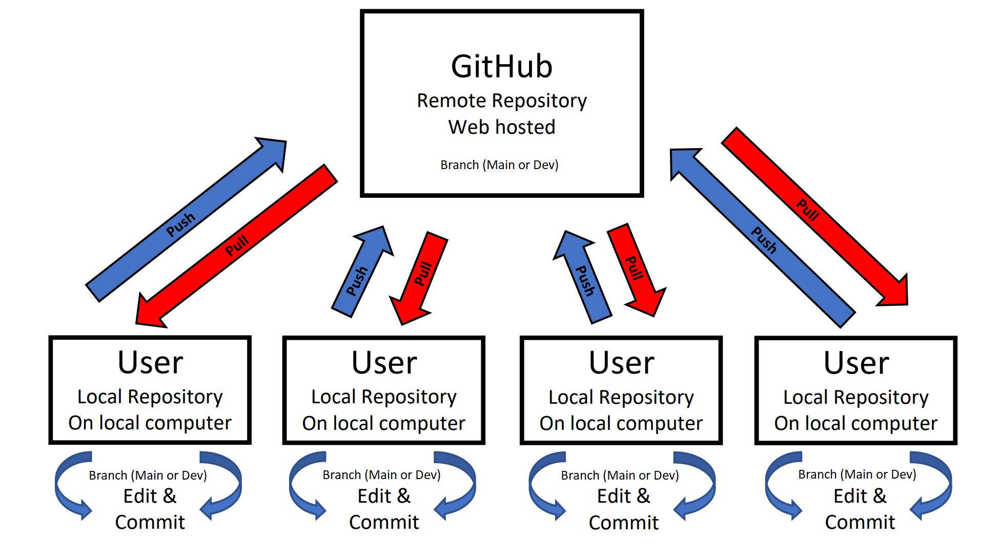
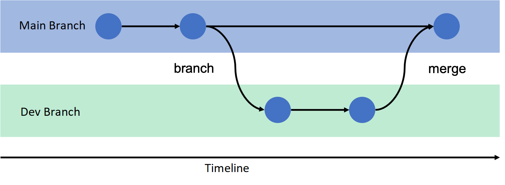

```{r setup, include=FALSE}
knitr::opts_chunk$set(echo = TRUE)
```


This is a starter guide for using GitHub, understanding its parts and features, and its integration with Program R to facilitate seamless group working and meeting of reproducibility standards. 


For starters, GitHub is the website on which you create a user account and manage all repository settings, and Git is the program that manages the local repositories on your separate machines. There has previously been some confusion as to what the difference between these terms were. 

As summered by some AI algorithm:

  "GitHub is a web-based platform that allows developers to create, store, and collaborate on software projects. It uses Git, an open-source version control software, to let multiple people make changes to code simultaneously. GitHub provides access control, bug tracking, and other features to help developers manage their projects."
  
As you can imagine, this is a really powerful tool in a world or remote workers and complex project structures by allowing everyone to stay up to date with the latest version of documents or analysis code. It is also useful for working on the same project on multiple machines, even for just one person, because it allows you to keep all your files up to date across machines.

Another power feature of Git, kinda the reason why it was made, is that it tracks and controls versions of files through time. If a bug gets introduced into a file, or you are just curious what a past version of a file looked like, you are able to essentially go back in time and continue working off a past version. It tracks what changes are made, who they are made by, and when they are saved. A very useful feature when many people are working on the same project. 

# What you will need to get set up

## GitHub

To get started, you will need to set up a user account on GitHub's website (https://github.com/signup). It will require that you verify your email address, so be sure you use an email you have access to. 

Once you have an account set up, navigate to the Git download website (https://git-scm.com/downloads) and select your operating system. I do not use a macOS, so if you are using a mac book, it looks like you will need to first install a third party program that will then install Git. If you are using a Windows OS, you will want to download the '64-bit Git for Windows Setup' program. 

Once the download is done, work through the instillation prompts. There are ~20 different options and you can just accept all the defaults. 

This gets us all set up with Git and GitHub. 

## R & RStudio

If you have made it to this point in R Bootcamp I think it's safe to assume that you already have R and R Studio installed on your computer. 

However, for those of you who are joining us just for today, you will need to download and install these programs. 
At this website you can download both R and R Studio https://posit.co/download/rstudio-desktop/. 

You will need to install Program R first, then download R Studio second. From what I remember, you can just accept all the defaults. 


# Exploring version controlled repository structure

Lets explore the structure of Git repositories. 

In the image below you can see that there are two levels of organization. The **GitHub** level is the central repository that serves at the common source of all shared information. It is the top level where all users and developers send their updates and where they get updates from others.\
The next level down is the **User** level. The 4 User boxes represent the local repositories on peoples individual computers. You could think of these as four computers that a single person work's on for their job, or it could represent four different users all working on the same project. \


```{r, echo=FALSE, out.width=700, out.height= 400, fig.cap="A nice image."}

```
\
Fig 1
\

Another cool aspect of Git is that you can split a repository into multiple branches. In the image below I have written out a 'Main' and a 'Dev' branch. The concept of a branch is splitting a repository into multiple identical versions of itself, and working on the two versions separately. The idea behind having a Main and Dev branch (which stands for development) is that all users can use the files or programs on the main branch while developers continue to tweak features or other functions on the Dev branch. When developers are building or designing new features it often leaves a project in a state that does not work. Therefore, they work in the Dev branch until the feature is fully operational then 'merge' the head of the Dev branch to the head of the Main branch to then make the new feature available to users. You can think of the two branches as working in parallel and periodically merging and splitting. 


```{r, echo=FALSE, out.width=700, out.height= 300, fig.cap="A nice image."}

```
\
Fig 2
\

# Operating within the system

The procedure for operating within this system has some good rules of thumb.\
If you are the only person working within a repository, this is kinda irreverent, but that also kinda defeats the purpose of using git in the first place!
\
So assuming there are multiple computers (weather that be different users or one person on multiple computers) editing a repository, there are some practices to follow to keep yourself out of trouble and causing problems in the system.
\
Every time you open a Git monitored repository you should first 'pull' from the remote repository. This is asking your computer to look in the remote repository for any updates, or differences between your local repository and remote repository and to bring those updates down to your local repository. By doing this you ensure that you are working on the most up to date version of the documents/files.\
It is important to note that you would need to 'pull' from each branch in the repository you plan on working in. If you are in the Main branch when you 'pull' Git will not get any changes from the 'Dev' branch and vice versa. \
\
After you 'pull', its Full steam ahead!\
\
Once you are finished with what you plan on working on and are headed home for the day, you need to follow a few steps.\
First you will need to commit the changes you made to your local repository. When you edit and save files within your local repository the changes will be visible imitatively when you save, but Git won't reflect those changes until you commit them. This makes sure that you are happy with the changes you made to the files before they are recognized by Git. When committing your changes you have to provide a short commit message. Usually less than 10 words this message should be a description of what you changed in the files you are committing. Git will attach your commit message to the commit for you to reference later, and for other users to see what you have been changing.\
Once you have committed your work to your local repository, you will 'push' your work. This command sends your updates to the remote repository for other users to incorporate into their local repositories.\
Once you have committed and pushed, you can go home and have a beer. 

# Building a repository

To create a new repository, you will start on the GitHub website.\
Lets practice with creating our own test repository.\
\
\
First, login to your GitHub account (if you aren't already), and naviagte to the home page. 
Somewhere on the home page there is a box in the middle of the page dedicated to creating new repositories. You will need to give your new repository a name, I'll do 'Test', and it gives you the option of making this repository public or private. For our test example we can make it private.\
\
Congrats! You made your first repository!\
\
Lets add our first file to our new repository. It is customary, and very useful, to always have a 'README' file in your repository. the README file will contain information about what this repository is for, what is contained within it, and what the structure is. To add a README file, which is just a file with some text named README.md, lets click on the README button under the quick set up menu. This will bring up an editing window for your new README file. Write something along the lines of 'My README file. This is my first repository!!' into the window and click commit changes. As mentioned above, this will prompt you to write a commit message. Enter something like 'Adding README file' into the window and again click commit changes. You have now added a file to your repository through the GitHub webpage.\

# Integrating R and Git

To have Git track files within an R working framework, the best coerce of action is to create a repository containing an R project and all your scripts/files.\
\
Let's clone our test repository to our computers. As it currently sits, our new repository is only on GitHub. To clone a repository open Rstudio, it doesn't matter if it is an existing project, and under the `File` button in the top left click `New Project...`. In the pop-up window click `Version Control`, and then `GIT`. Now we need to go back to the GitHub website and click the green `<> Code` button and copy the web address there. Paste the web address into the `Repository URL:` line. The `Project directory name:` should auto fill. To set the directory for where your new repository will live on your computer click the `Browse...` button and navigate to a folder on your computer. I would recommend not choosing a directory that is being synced or is web hosted, such as OneDrive. Before you click `Create Project` be sure to check the `Open in new session` box.\
\
It will start to clone your test repository but will likely ask you to verify your credentials somehow. GitHub has something called an access token that you can use to gain access to your profile, but I think logging in through a web browser is a much simpler method. After verifying your credentials your repository will finish cloning to your computer. You can now view all the repository files in the bottom right of your R Studio in the `Files` tab, there should be a `.gitignore`, `README.md` and `Tesr.Rproj` files. Go ahead and open the README.md file and add another line to your README beneath your existing line, something like 'My first Git integration with R!' and save the file.\
\
In the top right of your R Studio you notice that you have a new tab called `Git`. Click on that tab and notice the couple files displayed there. Your README file is there with a blue M next to it. Its presence in this pane indicates that you have altered the file and it has not yet been committed. In this particular case ALL the files in your new repository are new in the sense that they have never been committed before. The M means that you have modified this file, other options include A for added, and D for deleted (I assume). If you check the blank box to the left of the file you can stage the file for committing. Sometimes you only want to include certain files in your commit and you may not check all the boxes available to you. Go ahead and check all the available boxes and click the `Commit` button above the blue M and note the changes you made to the README file displayed at the bottom of the popup window. Enter a descriptive commit message in the upper right, such as 'Updated README file', and commit your changes. Your changes have now been committed to your local repository, but as you can see on the GitHub web page, the changes are not being reflected on the remote repository.\
To update the remote repository click the `Push` button with the green arrow. If there were no errors the closing message should be something along the lines of 'To <web address of remote repository> 42dc37a..fd4b912  HEAD -> main'. If you forget to follow the above guidelines and don't `Pull` before you commit changes on a file to your local repository and then try to push, you will run into problems. Git will tell you there are conflicts between the versions of a file in your local repository and the remote repository, and it will tell you to `Pull` the changes from the remote repository and resolve the version conflicts yourself. 

# Git Branches

Lets create a new branch in your test repository. If you look up in the top right of your R Studio while in the Git tab you can see a button labeled `main` with a drop down arrow.\
This is informing you that you are currently editing the main branch of the repository. The main branch is the single default branch for any new repository. If you click the drop down menu you see two sections containing the word main, one with a label `REMOTE:ORIGIN` and one unlabeled. The section labeled `REMOTE:ORIGIN` includes all available branches for this repository on the remote repository, and the other section includes all the available branches in your local repository. To add a new branch to your repository click the button directly to the left of the `main` button that resembles two purple blocks coming off a white diamond. This will produce a window prompting you to enter the new branch name and some other options. Type 'Dev' into the new branch window and accept the other options.\
You are now in a development branch! Lets add a file to this branch and push it to the remote repository. In the top left of the R Studio page click the white block with the green plus sign and select `R Script`. In this new R script write the code:\
```{r, eval=FALSE,echo=TRUE}

paste('Hello World')

```
\
then save the file as `Rscript' in the repository and commit the file in the Git tab.\
Lets switch back to the main branch by selecting main in the drop down menu, and notice how the R script we just made is not there. Switch back and forth between the Dev and main branches a few times to get accustomed to the operation and notice your new R script appear and disappear.\
\
Now lets merge the two branches. You would do this when whatever feature you were working on in the Dev branch is completed and ready to be added to the workflow on the main branch.\
To merge branches, click on the `Terminal` tab in the bottom left pane of the R Studio. To merge add the feature from the Dev branch to the main branch, make sure you are currently in the main branch, and type `git merge Dev` into the terminal. Sometimes you will need to update the Dev branch with the changes being made in the main branch, to do this make sure you are in the Dev branch and type `git merge main` into the terminal. 


